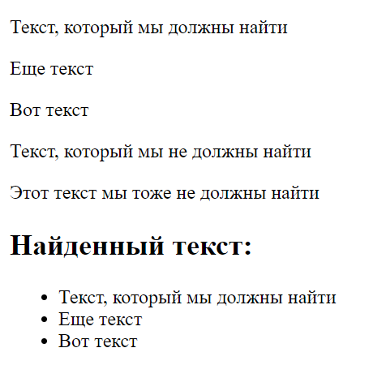

# recursion

Пример, взятый из книги 
Дэвида Флэнагана   
"JavaScript. Подробное руководство."

*recursion.js - файл с кодом*

Функция `textContent(e)` возвращает простое   
текстовое содержимое элемента `e`,  
выполняя рекурсивный обход всех дочерних
 элементов.